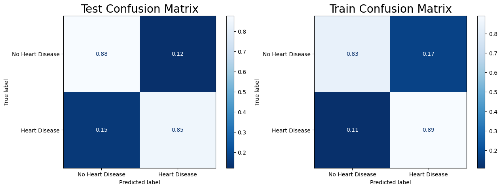

# Heart Failure Prediction
---

Analysis by Zach Dawson

This dataset was created for predictive modeling of heart failure risk in the data science community. In light of our topic, this would be beneficial for the medical industry, and if accurate enough, it may even be able to save lives.

Data Source: https://www.kaggle.com/datasets/fedesoriano/heart-failure-prediction

---

## Data Dictionary:

| Columns 	| Description 	|
|:---:	|:---:	|
| Age 	| age of the patient [years 	|
| Sex 	| sex of the patient [M: Male, F: Female 	|
| ChestPainType 	| chest pain type [TA: Typical Angina, ATA: Atypical Angina, NAP: Non-Anginal Pain, ASY: Asymptomatic 	|
| RestingBP 	| resting blood pressure [mm Hg 	|
| Cholesterol 	| serum cholesterol [mm/dl 	|
| FastingBS 	| fasting blood sugar [1: if FastingBS > 120 mg/dl, 0: otherwise 	|
| RestingECG 	| resting electrocardiogram results [Normal: Normal, ST: having ST-T wave abnormality (T wave inversions and/or ST elevation or depression of > 0.05 mV), LVH: showing probable or definite left ventricular hypertrophy by Estes' criteria 	|
| MaxHR 	| maximum heart rate achieved [Numeric value between 60 and 202 	|
| ExerciseAngina 	| exercise-induced angina [Y: Yes, N: No 	|
| Oldpeak 	| oldpeak = ST [Numeric value measured in depression 	|
| ST_Slope 	| the slope of the peak exercise ST segment [Up: upsloping, Flat: flat, Down: downsloping 	|
| HeartDisease 	| output class [1: heart disease, 0: Normal 	|

---
# EDA

---
# Model Evaluation
The RandomForestClassifier model can be used to estimate the number of patients who are at risk of heart failure based on the number of patients who are at risk. With RandomForestClassifier, subsets of training data are randomly selected to create decision trees.

## Model Scores
### RandomForestClassifier

Training Score: 0.89

This is not bad for an accuracy score for the training set. With a few more hypertunning and boosting avaiablities at hand. That score could be elevated and the model could stay accurate.

Testing Score: 0.87

Test Classification Report: 

              precision    recall  f1-score   support

           0       0.82      0.88      0.85        98
           1       0.90      0.86      0.88       132

The LogisticRegression model resulted in the highest scores for the models chosen for this analysis. It has a higher testing score with DecisionTreeClassifier and RandomForestClassifier. It has the highest precision score than the other models.

This is a confusion matrix that shows all the False Positive, True Positive, False Negatives, and True Negatives. The ratio difference in this model made me believe that it can be configured easier for later developement.

## Model Real Life Probility
More than likely this model is no where near being able to predict something like this for a couple of months. However, with futher development, configure this model to predict the score with more false positives than negatives. It could be used to predict patients at risk heart disease. 
